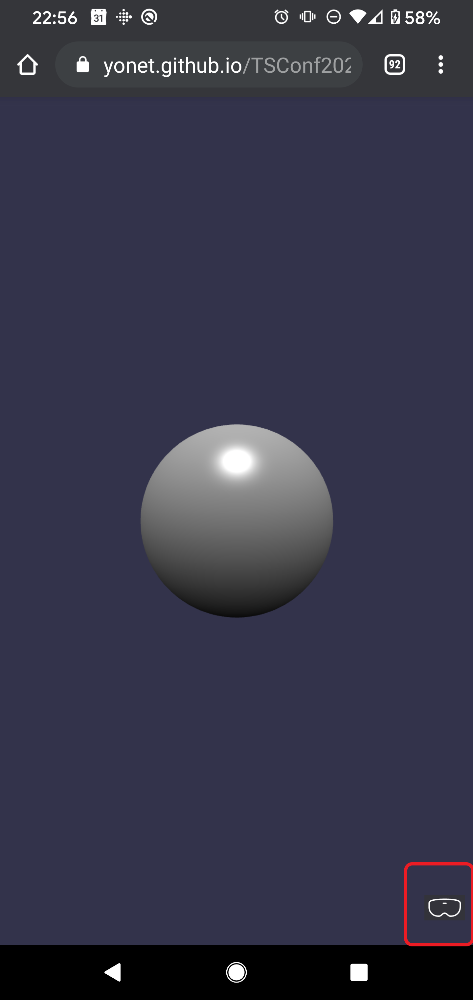
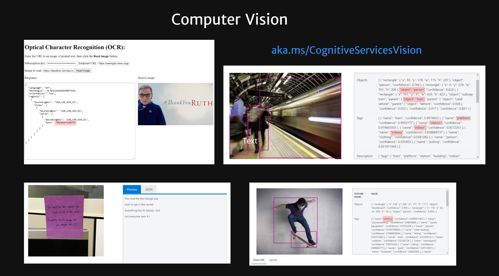
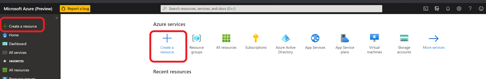
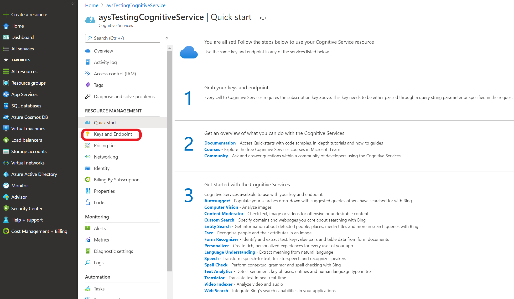

# TSConf 2020 WebXR Demo

[WebXR](https://www.w3.org/TR/webxr/) demo app for [TSConf2020](https://tsconf.io/).

## Technologies

* [BabylonJS](https://www.babylonjs.com/)
* [Azure Computer Vision](https://docs.microsoft.com/azure/cognitive-services/computer-vision/?WT.mc_id=aiml-8438-ayyonet)
* [WebXR](https://docs.microsoft.com/windows/mixed-reality/develop/web/webxr-overview?WT.mc_id=spatial-8871-ayyonet)
* [TypeScript](https://www.typescriptlang.org/?WT.mc_id=spatial-8871-ayyonet)
* [BabylonJS-webpack-es6 starter](https://github.com/RaananW/babylonjs-webpack-es6) by [Raanan Weber](https://github.com/RaananW)
* [Mixed Reality](https://docs.microsoft.com/windows/mixed-reality/develop/web/javascript-development-overview?WT.mc_id=spatial-8871-ayyonet)
* [BabylonJS Playground](https://playground.babylonjs.com)
* [BabylonJS documentation](https://doc.babylonjs.com)
* [BabylonJS WebXR Docs](https://doc.babylonjs.com/how_to/introduction_to_webxr)
* Check out more [Cognitive Services](https://azure.microsoft.com/services/cognitive-services/?WT.mc_id=aiml-8438-ayyonet), for [Sentiment](https://docs.microsoft.com/azure/databricks/scenarios/databricks-sentiment-analysis-cognitive-services?toc=https%3A%2F%2Fdocs.microsoft.com%2Fen-us%2Fazure%2Fcognitive-services%2Ftext-analytics%2Ftoc.json&bc=https%3A%2F%2Fdocs.microsoft.com%2Fen-us%2Fazure%2Fbread%2Ftoc.json&WT.mc_id=aiml-8438-ayyonet) and [Spatial analysis](https://docs.microsoft.com/legal/cognitive-services/computer-vision/responsible-use-deployment?context=/azure/cognitive-services/Computer-vision/context/context&WT.mc_id=aiml-8438-ayyonet), [Anamoly Detection](https://docs.microsoft.com/azure/cognitive-services/anomaly-detector/?WT.mc_id=aiml-8438-ayyonet) and more.

## Getting started

To run the basic scene:

1. run `npm install` to install the needed dependencies.
2. run `npm start`
3. A new window should open in your default browser. if it doesn't, open `http://localhost:8080`
Running `npm start` will start the webpack dev server with hot-reloading turned on. Open your favorite editor (mine is VSCode, but you can use nano. we don't discriminate) and start editing.

Click on the headset icon on the bottom left corner to view in immersive mode.

The entry point for the entire TypeScript application is `./src/index.ts` . Any other file imported in this file will be included in the build.

To debug, open the browser's dev tool. Source maps are ready to be used. In case you are using VSCode, simply run the default debugger task ( `Launch Chrome against localhost` ) while making sure `npm start` is still running. This will allow you to debug your application straight in your editor.

### Running Computer Vision Sample

To be able to run the demo, you need to sign up for an Azure Cognitive Services Account and add your key and url to the form on [get-printed-text.html](./main/public/get-printed-text.html).

- Sign up for a [free account for Azure for a Cognitive Services](https://azure.microsoft.com/free/?WT.mc_id=aiml-8438-ayyonet) Key.
- Go to [Azure Portal](https://azure.microsoft.com/features/azure-portal/?WT.mc_id=aiml-8438-ayyonet) to create a Computer Vision resource.
- Click "Create Resource" and search for Computer Vision.

- Once resource is created, on the overview of the resource, find Keys and Endpoints tab.

- Copy and paste your key and endpoint url on the html input and add an image to analyse.

Check out more [Cognitive Services](https://azure.microsoft.com/services/cognitive-services/?WT.mc_id=aiml-8438-ayyonet), for [Sentiment](https://docs.microsoft.com/azure/databricks/scenarios/databricks-sentiment-analysis-cognitive-services?toc=https%3A%2F%2Fdocs.microsoft.com%2Fen-us%2Fazure%2Fcognitive-services%2Ftext-analytics%2Ftoc.json&bc=https%3A%2F%2Fdocs.microsoft.com%2Fen-us%2Fazure%2Fbread%2Ftoc.json&WT.mc_id=aiml-8438-ayyonet) and [Spatial analysis](https://docs.microsoft.com/legal/cognitive-services/computer-vision/responsible-use-deployment?context=/azure/cognitive-services/Computer-vision/context/context&WT.mc_id=aiml-8438-ayyonet), [Anamoly Detection](https://docs.microsoft.com/azure/cognitive-services/anomaly-detector/?WT.mc_id=aiml-8438-ayyonet) and more.

## Loading different examples

The `./src/scenes` directory contains a few examples of scenes that can be loaded. To load a specific scene, add a `?scene=FILENAME` to the URL (i.e. to load the ammo physics demo, use `http://localhost:8080/?scene=physicsWithAmmo` ).

## What else can I do

To lint your source code run `npm run lint`
To build the bundle in order to host it, run `npm run build` . This will bundle your code in production mode, meaning is will minify the code.

Building will take some time, as it will build each sample (and create a different module for each). If you want to speed up the process, define the scene you want to render in `createScene.ts` (you can see the comment there)

## What is covered

* Latest typescript version
* Simple texture loading (using url-loader)
* dev-server will start on command (webpack-dev-server)
* A working core-only example of babylon
* Full debugging with any browser AND VS Code
* (production) bundle builder.
* eslint default typescript rules integrated
